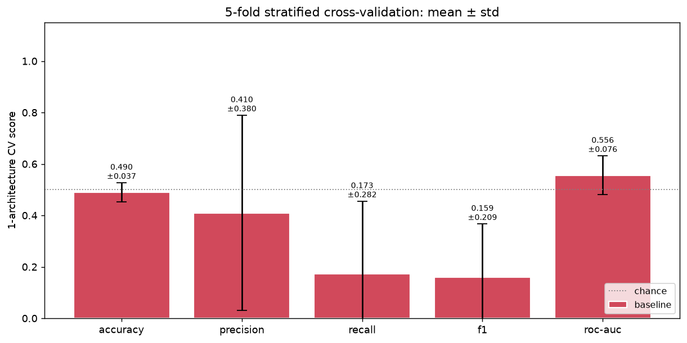
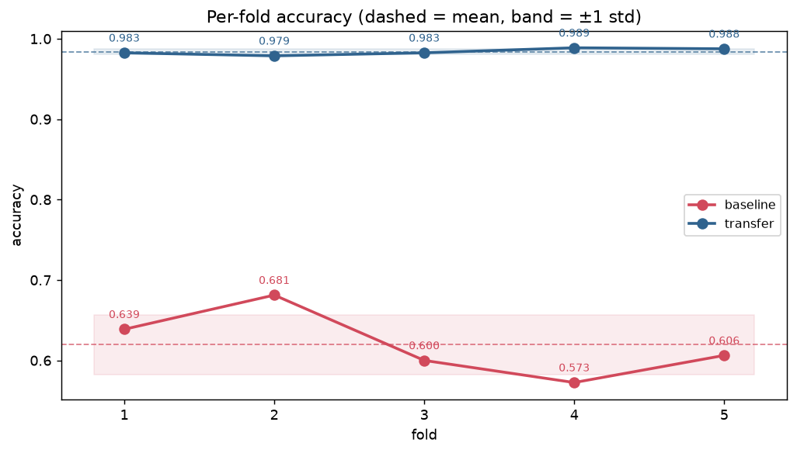
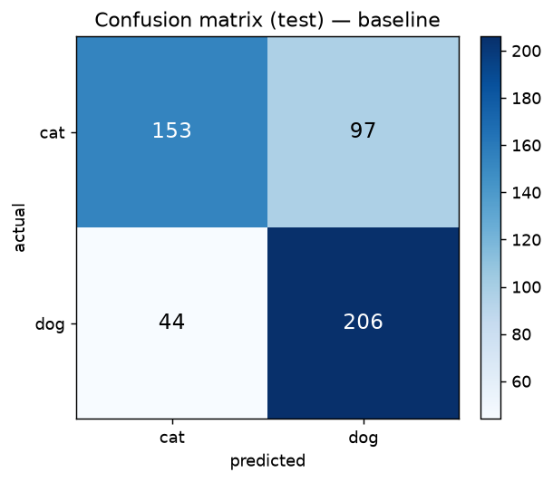
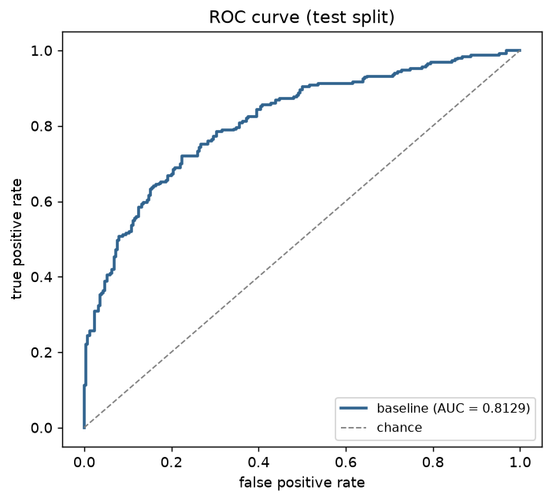
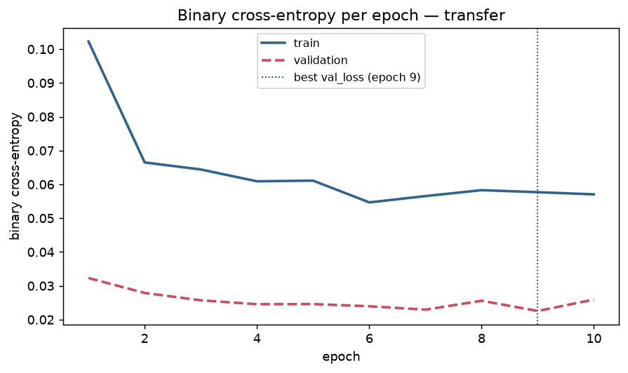
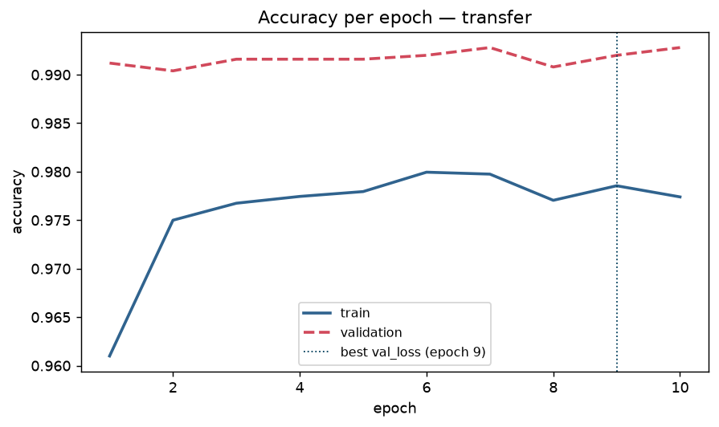
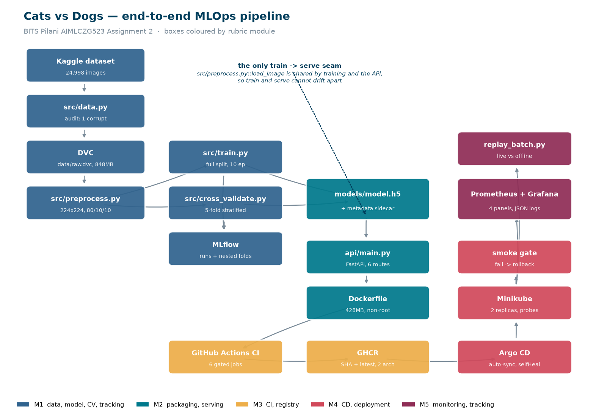

# Cats vs Dogs MLOps

End-to-end MLOps pipeline for binary image classification (cats vs dogs), framed
as the intake classifier for a pet adoption platform: CNN training with
cross-validation, MLflow experiment tracking, DVC data versioning, a FastAPI
inference service, Docker packaging, GitHub Actions CI publishing to GHCR, Argo
CD continuous deployment onto Kubernetes, and Prometheus/Grafana monitoring.

Built for AIMLCZG523 Assignment 2 at BITS Pilani.

**Repository:** https://github.com/2024ac05731-cyber/cats-dogs-mlops

**Demo video:** _link added after recording (Day 10)_

## Stack

[](https://github.com/2024ac05731-cyber/cats-dogs-mlops/actions/workflows/ci.yml)

| Layer               | Tool                                  |
|---------------------|---------------------------------------|
| Modeling            | TensorFlow / Keras (CNN)              |
| Data versioning     | DVC                                   |
| Experiment tracking | MLflow                                |
| API                 | FastAPI                               |
| Container           | Docker                                |
| Registry            | GitHub Container Registry (GHCR)      |
| CI                  | GitHub Actions                        |
| CD                  | Argo CD (GitOps)                      |
| Orchestration       | Kubernetes (Minikube)                 |
| Monitoring          | Prometheus + Grafana                  |

## Dataset

[Cats and Dogs classification dataset](https://www.kaggle.com/datasets/bhavikjikadara/dog-and-cat-classification-dataset)
from Kaggle. Pre-processed to 224x224 RGB and split 80/10/10 into
train/validation/test, stratified by class, with augmentation applied to the
training split only.

## Cross-validation

**5-fold stratified cross-validation**, run by `python -m src.cross_validate`. Per-fold results are
in [`reports/cv_results.csv`](reports/cv_results.csv); figures below; nested `fold_1`…`fold_5` runs
sit under `cv-transfer` / `cv-baseline` in MLflow.

### Summary — mean ± std over 5 folds

| Model | Accuracy | Precision | Recall | F1 | ROC-AUC |
|---|---|---|---|---|---|
| **MobileNetV2 transfer** | **0.9840 ± 0.0037** | 0.9798 ± 0.0088 | 0.9885 ± 0.0025 | 0.9841 ± 0.0036 | 0.9984 ± 0.0013 |
| Baseline CNN (from scratch) | 0.6198 ± 0.0373 | 0.7229 ± 0.1120 | 0.4915 ± 0.2429 | 0.5285 ± 0.1484 | 0.7113 ± 0.0474 |

### Per-fold results

Reported individually, not just as a mean: an aggregate with no visible components can't be verified.

| Model | Fold | Accuracy | Precision | Recall | F1 | ROC-AUC | Time |
|---|---|---|---|---|---|---|---|
| transfer | 1 | 0.9825 | 0.9730 | 0.9925 | 0.9827 | 0.9961 | 82 s |
| transfer | 2 | 0.9788 | 0.9682 | 0.9900 | 0.9790 | 0.9985 | 82 s |
| transfer | 3 | 0.9825 | 0.9777 | 0.9875 | 0.9826 | 0.9984 | 85 s |
| transfer | 4 | 0.9888 | 0.9900 | 0.9875 | 0.9887 | 0.9996 | 98 s |
| transfer | 5 | 0.9875 | 0.9899 | 0.9850 | 0.9875 | 0.9995 | 88 s |
| baseline | 1 | 0.6388 | 0.8447 | 0.3400 | 0.4848 | 0.7633 | 262 s |
| baseline | 2 | 0.6813 | 0.6659 | 0.7275 | 0.6953 | 0.7603 | 269 s |
| baseline | 3 | 0.6000 | 0.6667 | 0.4000 | 0.5000 | 0.6435 | 294 s |
| baseline | 4 | 0.5725 | 0.8625 | 0.1725 | 0.2875 | 0.6725 | 297 s |
| baseline | 5 | 0.6062 | 0.5747 | 0.8175 | 0.6749 | 0.7169 | 293 s |




### Protocol

| | |
|---|---|
| Splitter | `StratifiedKFold(n_splits=5, shuffle=True, random_state=42)` |
| Pool | pooled **train + val** (22,496 files); the 2,501-file **test split is never touched** |
| Subset | 4,000 files, sampled **randomly and stratified** under `random_state=42` |
| Per fold | 3,200 train / 800 validate, 8 epochs, batch 32, Adam @ 1e-3 |
| Total | 10 fits, **31.3 min** wall-clock (CPU, Apple M4 Pro — see ADR-011) |

**Why a subset:** measured at ~10 ms/image/epoch on this CPU, 5 folds × 2 architectures over the full
22,496 pooled files would take ~5.7 hours versus ~31 min at 4,000. The reduction is deliberate and
recorded here rather than left implicit.

**Fold isolation is verified, not assumed.** Reusing a compiled Keras model across folds would carry
both learned weights *and* optimizer momentum into the next fold, leaking the held-out data — and it
would make the scores look *better*, so it can't be left to chance. `verify_fold_isolation()` hashes
every weight tensor before and after each fit and asserts three properties: initial fingerprints
identical across folds (the model really was rebuilt), trained ≠ initial (the fit did something), and
trained fingerprints distinct between folds (the folds really differ). The run reports:

```
[cv] verified: 0 of 2,501 test files present in the CV pool
[cv] verified: model rebuilt+recompiled per fold, no weight or optimizer
     state carried across fold boundaries
```

### What CV decided

The production model is selected **by CV mean, not by a single test split** (ADR-005). The means are
not close, but the *variance* is the more telling result: the baseline's recall standard deviation of
**± 0.2429** means one train/test split could have reported anywhere from 0.17 to 0.82 for that same
architecture. The transfer model's **± 0.0037** accuracy says its performance is a property of the
architecture rather than of the split — which is exactly what cross-validation exists to establish.

The baseline is a genuine control, not a strawman, but it is also undertrained at 8 epochs: it needs
~11 before it stops collapsing to a single class (ADR-009). Its numbers represent "a small CNN on a
CV-affordable budget", not the architecture's ceiling.

## Results

Shipped model: **MobileNetV2 transfer learning** (frozen ImageNet base, custom head),
selected by cross-validated mean accuracy — see [Cross-validation](#cross-validation) and ADR-005.

Trained on the **full** 19,997-image train split for 10 epochs (50.6 s/epoch, ~8.5 min, CPU) and
evaluated on the held-out 2,501-image test split, which was never used for training,
validation, or cross-validation.

| Metric | Test split (n=2,501) | 5-fold CV (mean ± std) |
|---|---|---|
| Accuracy | **0.9924** | 0.9840 ± 0.0037 |
| Precision | 0.9952 | 0.9798 ± 0.0088 |
| Recall | 0.9896 | 0.9885 ± 0.0025 |
| F1 | 0.9924 | 0.9841 ± 0.0036 |
| ROC-AUC | 0.9997 | 0.9984 ± 0.0013 |

The test score sits slightly above the CV mean, which is expected: CV trained each fold on 3,200
images while the final model saw 19,997. The two agree closely enough that neither looks like a fluke
of one split — which is the point of reporting both.






Artifacts: `models/model.h5` (9.4 MB) plus `models/model_metadata.json`, which records the package
versions, hyperparameters, input shape, class-index map, both metric sets, and the training device.
`scripts/daily_audit.py` cross-checks that sidecar against `requirements.txt`, so a model trained
under drifted dependencies is caught rather than shipped.

All timings are CPU (Apple M4 Pro). No GPU was used — `tensorflow-metal` is incompatible with
TensorFlow 2.20 (ADR-011).

## How this maps to the rubric

Every graded item with the exact path that satisfies it. If you have five minutes and a
rubric, start here.

### M1 — Model Development & Experiment Tracking (10)

| Requirement | Where |
|---|---|
| Git for source versioning | this repo, [commit history](../../commits/main) |
| DVC for dataset versioning | [`data/raw.dvc`](data/raw.dvc) (24,998 files, 848 MB), [`.dvc/config`](.dvc/config) |
| DVC tracks pre-processed data | [`dvc.yaml`](dvc.yaml) `preprocess` stage → `data/processed/{train,val,test}.csv`, [`dvc.lock`](dvc.lock) |
| Reproducible pipeline | `dvc repro` — 3 stages: `preprocess`, `train`, `cross_validate` |
| 224×224 RGB pre-processing | [`src/preprocess.py`](src/preprocess.py) `load_image()` |
| Stratified 80/10/10 split | `build_split_manifests()` — 19,997 / 2,499 / 2,501, all 50.0 % dog, provably disjoint |
| Data augmentation | `build_augmentation()` — flip/rotation/zoom/contrast, clipped, **train only** |
| Baseline model | [`src/model.py`](src/model.py) `build_baseline_cnn()` — 242,369 params |
| Second model | `build_transfer_model()` — MobileNetV2, frozen base, 1,281 trainable |
| Serialized model | [`models/model.h5`](models/model.h5) + [`model_metadata.json`](models/model_metadata.json) |
| **Cross-validation** | [`src/cross_validate.py`](src/cross_validate.py), [`reports/cv_results.csv`](reports/cv_results.csv) (10 per-fold rows), [2 figures](reports/figures), [§ Cross-validation](#cross-validation) |
| MLflow: runs, params, metrics | `mlruns/`, `bash scripts/mlflow_ui.sh` — 2 parent CV runs + 10 nested `fold_N` runs |
| MLflow artifacts | confusion matrix, loss curves, accuracy curves, ROC, `cv_results.csv` |

### M2 — Model Packaging & Containerization (10)

| Requirement | Where |
|---|---|
| REST API | [`api/main.py`](api/main.py) — FastAPI |
| Health check endpoint | `GET /health` → `{"status":"ok","model_loaded":true}` |
| Prediction endpoint | `POST /predict` (multipart), `POST /predict/base64` |
| Returns class probabilities + label | `{"label":"cat","probabilities":{"cat":0.999999,"dog":1e-6},...}` |
| Dependencies + version pinning | [`requirements.txt`](requirements.txt), [`requirements-serve.txt`](requirements-serve.txt) — all `==` pinned |
| Dockerfile | [`Dockerfile`](Dockerfile) — slim base, non-root `appuser`, `HEALTHCHECK` |
| Built and verified locally | 428 MB content; healthy in 4 s; cat→`cat` @0.999999, dog→`dog` @0.999874, corrupt→`422` |

### M3 — CI Pipeline (10)

| Requirement | Where |
|---|---|
| Unit test: pre-processing function | [`tests/test_preprocess.py`](tests/test_preprocess.py) — 22 tests |
| Unit test: model/inference function | [`tests/test_model.py`](tests/test_model.py) — 19 tests |
| API tests | [`tests/test_api.py`](tests/test_api.py) — 23 tests. **64 total** |
| CI on every push / PR | [`.github/workflows/ci.yml`](.github/workflows/ci.yml) — 6 jobs |
| Checkout, install, test, build | jobs `lint` → `test` → `build`, gated by `needs:` |
| Push to a container registry | job `publish` → `ghcr.io/2024ac05731-cyber/catdog-api`, **SHA + `latest`**, multi-arch |

### M4 — CD Pipeline & Deployment (10)

| Requirement | Where |
|---|---|
| Deployment target manifests | [`k8s/deployment.yaml`](k8s/deployment.yaml), [`k8s/service.yaml`](k8s/service.yaml) |
| Pull new image from registry | `imagePullPolicy` + SHA-tagged GHCR image |
| Auto-deploy on main changes | [`argocd/application.yaml`](argocd/application.yaml) (auto-sync, prune, selfHeal) + [`cd.yml`](.github/workflows/cd.yml) `gitops-bump` |
| Post-deploy smoke test | [`scripts/smoke_test_deployed.py`](scripts/smoke_test_deployed.py) — `/health` **and** a correct `/predict` |
| Fail the pipeline if smoke fails | `cd.yml` job `verify`; exits non-zero → `kubectl rollout undo` |

### M5 — Monitoring, Logs & Submission (10)

| Requirement | Where |
|---|---|
| Request/response logging | `api/main.py` middleware — one JSON object per request |
| Excluding sensitive data | logs byte size + 12-char SHA-256 prefix, **never image bytes**; asserted by `test_logs_never_contain_image_bytes` |
| Request count | Prometheus `http_requests_total`, custom `catdog_predictions_total`, in-app counters on `GET /` |
| Latency | `http_request_duration_seconds` histogram; measured p50 45 ms / p95 64 ms |
| Monitoring stack | [`monitoring/README.md`](monitoring/README.md), [`grafana_dashboard.json`](monitoring/grafana_dashboard.json) (4 panels), [`k8s/servicemonitor.yaml`](k8s/servicemonitor.yaml) |
| Post-deployment tracking | [`scripts/replay_batch.py`](scripts/replay_batch.py) → [`reports/post_deployment_report.md`](reports/post_deployment_report.md) |
| Batch + true labels | `data/monitoring/labelled_batch/labels.csv` — held out from the test split |

### Project management

`tracker/` is a shipped deliverable, not scratch: [`GUARDRAILS.md`](tracker/GUARDRAILS.md) (why A1 lost
marks and the rules preventing a repeat), [`DECISIONS.md`](tracker/DECISIONS.md) (12 ADRs),
[`PROGRESS.md`](tracker/PROGRESS.md), [`TASKS.md`](tracker/TASKS.md), [`EVIDENCE.md`](tracker/EVIDENCE.md),
[`DAILY_LOG.md`](tracker/DAILY_LOG.md).

A 100-point audit enforces those rules mechanically — `python scripts/daily_audit.py --day 10`.

## Architecture



The seam that matters: **`models/model.h5` is the only thing crossing from training into
serving**, and `src/preprocess.py::load_image` is shared by both, so train and serve cannot
drift apart. A train/serve preprocessing skew leaves offline metrics untouched while quietly
degrading live predictions — `scripts/replay_batch.py` exists to detect exactly that, and
measured a +0.0076 delta (i.e. none).

## Project structure

```
cats-dogs-mlops/
├── data/              # raw + processed (DVC-tracked) + monitoring batch
├── notebooks/         # thin EDA driver
├── src/               # data, preprocess, model, train, cross_validate, predict
├── api/               # FastAPI service
├── tests/             # pytest + committed fixtures
├── k8s/               # Deployment, Service, ServiceMonitor
├── argocd/            # Argo CD Application
├── monitoring/        # Grafana dashboard + PromQL notes
├── scripts/           # download, mlflow_ui, smoke tests, replay, daily_audit
├── models/            # model.h5 + model_metadata.json
├── reports/           # figures, cv_results.csv, screenshots
├── tracker/           # progress, tasks, decisions, evidence, guardrails
├── .github/workflows/ # ci.yml, cd.yml
├── Dockerfile
├── requirements.txt / requirements-serve.txt
└── README.md
```

## Setup

Requires Python 3.11 and a Kaggle API token.

```bash
git clone <repo-url>
cd cats-dogs-mlops

python3.11 -m venv .venv
source .venv/bin/activate

pip install --upgrade pip
pip install -r requirements.txt
```

Kaggle credentials — this project uses the newer `KGAT_` access-token format:

```bash
mkdir -p ~/.kaggle
echo "<your-token>" > ~/.kaggle/access_token
chmod 600 ~/.kaggle/access_token
```

Accept the dataset terms once in a browser, or the API returns 403.

## Quickstart

```bash
# 1. Data (writes data/raw/; idempotent, DATA_FORCE=1 to refetch)
bash scripts/download.sh
python -m src.data                 # counts, class balance, corrupt-image audit

# 2. Preprocess: 224x224 RGB, stratified 80/10/10 manifests
dvc repro preprocess
python -m src.eda                  # 3 EDA figures -> reports/figures/
```

> **Activate the venv before running `dvc repro`.** DVC stages use bare
> `cmd: python -m ...`, which resolves against `PATH`. Without the venv active,
> macOS may resolve `python` to the system Python 2.7 and the stage dies with a
> `SyntaxError` on modern type hints. `source .venv/bin/activate` first.

```bash
# 3. Train and cross-validate
python -m src.train --model transfer
python -m src.cross_validate       # -> reports/cv_results.csv + CV figures
bash scripts/mlflow_ui.sh          # http://localhost:5000

# 4. Quality gate (the same commands CI runs)
ruff check .
pytest -v
python scripts/smoke_test.py

# 5. Serve
uvicorn api.main:app --reload      # http://127.0.0.1:8000/docs
curl -F "file=@tests/fixtures/cat_sample.jpg" http://localhost:8000/predict

# 6. Container
docker build -t catdog-api:dev .
docker run -p 8000:8000 catdog-api:dev
```

## Daily audit

This project is graded against a rubric, so a 100-point audit enforces the
artifact and consistency rules in `tracker/GUARDRAILS.md`:

```bash
python scripts/daily_audit.py --day 3            # end of day 3
python scripts/daily_audit.py --day 3 --verbose  # include not-yet-active checks
python scripts/daily_audit.py --day 10 --only CONSISTENCY
```

It fails non-zero on any active violation, and calls out failures on the two
axes that lost marks on Assignment 1 (cross-validation visibility and CI/CD
depth).

## Author

maheshkumar Ganesan, BITS Pilani (AIMLCZG523).

## License

Coursework. Please don't redistribute.
