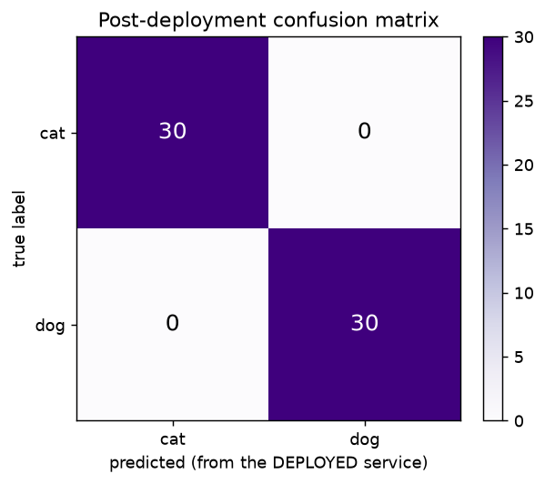
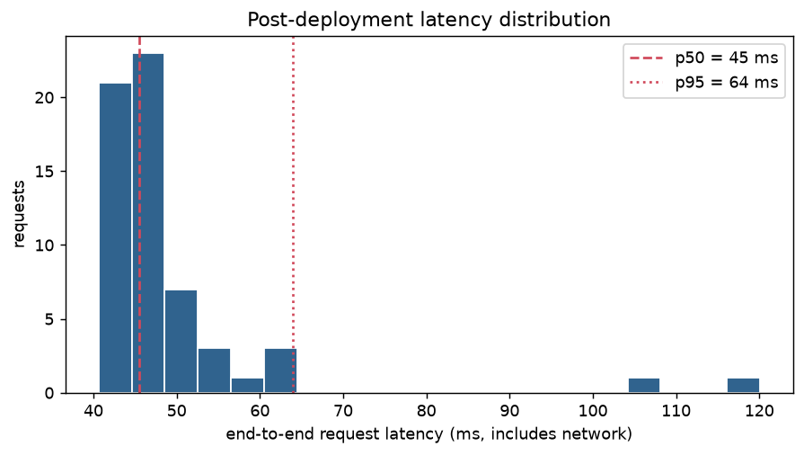

# Post-deployment performance report (M5)

Generated by `python scripts/replay_batch.py --url http://localhost:8000 --n 60`.

A labelled batch was sent to the **deployed service over HTTP** and each response
compared against its known label. Images come from the **test split**, which the
model never trained, validated, or cross-validated on.

## Live results (60 scored requests, 0 error(s))

| Metric | Live (deployed) | Offline (test split) | Delta |
|---|---|---|---|
| Accuracy | 1.0000 | 0.9924 | +0.0076 |
| Precision | 1.0000 | 0.9952 | +0.0048 |
| Recall | 1.0000 | 0.9896 | +0.0104 |
| F1 | 1.0000 | 0.9924 | +0.0076 |

## Confusion matrix (from deployed responses)

|  | predicted cat | predicted dog |
|---|---|---|
| **true cat** | 30 | 0 |
| **true dog** | 0 | 30 |

## Latency

End-to-end, measured client-side, so it includes network and serialisation — not
just model inference.

| | ms |
|---|---|
| p50 | 45 |
| p95 | 64 |
| min | 41 |
| max | 120 |

## Interpretation

No meaningful train/serve skew: live metrics track the offline test metrics closely, so the deployed preprocessing matches training.

Why this comparison is worth making at all: training already measured accuracy
offline, so re-measuring it proves little on its own. What it *does* prove is that
the deployed path agrees with the training path. A train/serve preprocessing skew
leaves offline metrics untouched while quietly degrading live predictions, and
comparing the two on identical data is the only way to see it.

Per-request detail: [`post_deployment_predictions.csv`](post_deployment_predictions.csv).
